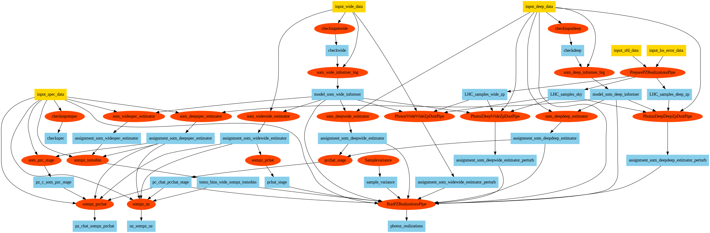

# Roman SOMPZ

Self-Organizing Map Photo-z (SOMPZ) implementation for Roman Space Telescope photometric redshift estimation.

## Overview

Roman SOMPZ uses self-organizing maps to estimate photometric redshifts from multi-band photometry. This package provides tools for:
- Train SOM models
- Assign SOM cells for each galaxy 
- Estimate n(z) distributions
- Perform uncertainty quantifications
- Summarize n(z) realizations
- Generate diagnostic plots

## Flow chart 


### Prerequisites

- Python 3.11+
- pip

### Submodule dependencies

This project uses the following as git submodules:
- `rail_base` - Core RAIL (Redshift Assessment Infrastructure Layers) framework
- `tables_io` - I/O utilities for tabular data

### Note
Do this in the Roman-SOMPZ directory after git pull. Otherwise it may not read the changes.
```
pip install .
```
RAIL I/O Issue:
When running a galaxy number > 1,048,576 (1MB), please set your config chunk_size to a power of 2 (like 2048 or 4096) as a solution for now.
HDF5 chunks are this size, and the I/O handles parallel reading by cutting chunks precisely at these boundaries. However, the start index of the next process is not currently adjusted in RAIL. Because of this, galaxy assignments beyond 1,048,576 will not end up in the right place. 

## NERSC installation 
1. Fork the repository
2. Clone the Roman-SOMPZ repository with submodules:
```
git clone --recurse-submodules https://github.com/yourusername/Roman-SOMPZ.git
```
3. Clone scm-pipeline
```
git clone https://github.com/Roman-HLIS-Cosmology-PIT/scm-pipeline.git
```
4. Clone ceci
```
git clone https://github.com/LSSTDESC/ceci.git
```
5. Create an environment
```
module load python
conda create --name sompz_roman python=3.11 ipykernel
conda activate sompz_roman
```
6. Enable mpi4py and parallel hdf5
```
module swap PrgEnv-${PE_ENV,,} PrgEnv-gnu 
module load cray-hdf5-parallel
MPICC="cc -shared" pip install --force-reinstall --no-cache-dir --no-binary=mpi4py mpi4py
```
```
export HDF5_DIR=$HDF5_ROOT
conda install -c defaults --override-channels numpy "cython>=3"
HDF5_MPI=ON CC=cc pip install -v --force-reinstall --no-cache-dir --no-binary=h5py --no-build-isolation --no-deps h5py
```
7. Install scm-pipeline and ceci
```
cd scm-pipeline
pip install -e.
cd ../ceci
pip install -e.
cd ../Roman-SOMPZ
```
8. Install the Roman-SOMPZ package:
```
sh install.sh
```
9. Download dust maps 
```
cd job/data
gdown  1NARLZe2inHRVsC_9-UQ-i3vIHeJCjajc
gdown  1Cui9ED_ZcdZBGjFyCdFaqrj3chGWFiUy
cd ..
cd ..
```
10. If you cloned without `--recurse-submodules`, initialize them with:
```
git submodule update --init --recursive
```
11. Quick Start
```
cd job
ceci ../yaml/test_all.yaml
```


## DCC (Duke Computing Cluster) Installation
DCC has strict HDF5 sync checks due to file locking. This may result in 
```
SError: Can't synchronously write data (Can't perform independent write when MPI_File_sync is required by ROMIO driver.)
```
Disable the strict file sync by running the following code:
```
export HDF5_DO_MPI_FILE_SYNC=0
```
### In yml file 
```
site:
  max_threads: 128
  mpi_command: srun -n  ##Add this
  name: local
```

```
## Quick Start
```
cd job
ceci ../yaml/test_all.yaml
```

## Usage Examples

See job/run_ceci.sh for examples

## Contributing

Contributions are welcome! Please:
1. Fork the repository
2. Create a feature branch
3. Make your changes
4. Submit a pull request


## Contact

- **Author**: Chun-Hao To, Boyan Yin, Diogo Souza 
- **Email**: chunhaoto@gmail.com, boyan.yin@duke.edu, diogo.henrique@unesp.br
